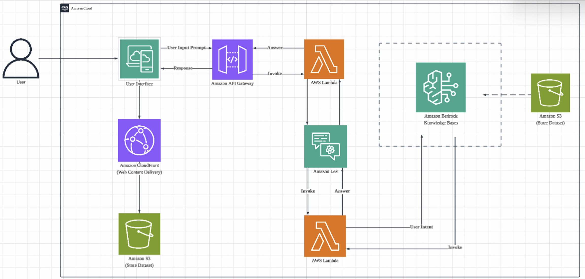

# 🌏 SemAI Bot — AI Chatbot for Endangered Language Preservation

## 📌 Overview

SemAI Bot is an AI-powered chatbot designed to preserve and promote the Semai language, an endangered Orang Asli language in Malaysia.

This project was developed during an AWS Hackathon, combining conversational AI, cloud computing, and generative AI to create an accessible platform for language learning and cultural exploration. (Group: SATRIA)

---

## 🧠 Problem Statement

Many indigenous languages, including Semai, are at risk of extinction due to:

* Lack of accessible learning resources
* Declining daily usage
* Limited digital presence

As highlighted in our research, language loss represents not only disappearing words, but also the erosion of cultural identity and heritage.

---

## 💡 Solution

We developed **SemAI Bot**, an interactive chatbot that allows users to:

* Translate between Semai, Malay, and English
* Learn pronunciation using AI-generated speech
* Explore cultural stories and folklore
* Interact through a natural conversational interface

---

## ⚙️ System Architecture

Based on our system design, the architecture follows a serverless AI pipeline:


1. User interacts via web interface
2. Request sent through API Gateway
3. AWS Lambda processes logic
4. Amazon Lex handles intent recognition
5. Amazon Bedrock generates contextual responses
6. Amazon S3 stores language datasets
7. Amazon Polly provides speech output
   

---

## 🛠️ Tech Stack

### ☁️ AWS Services

* **AWS Lambda** → backend logic
* **Amazon Lex** → chatbot NLP
* **Amazon Bedrock** → generative AI responses
* **Amazon S3** → dataset storage
* **Amazon CloudFront** → frontend delivery
* **Amazon Polly** → text-to-speech
 

### 💻 Development

* Python (Lambda functions)
* HTML (frontend interface)

---

## ✨ Key Features

### 🌐 Multilingual Translation

Supports translation between:

* Semai
* Malay
* English


### 📚 Cultural Storytelling

* Retrieves Semai folklore from dataset
* Enhances responses using generative AI


### 🤖 AI-Powered Conversations

* Natural interaction using Amazon Lex + Bedrock
* Context-aware responses

---


## 🎥 Demo Video

[](https://www.youtube.com/watch?v=HopxmvpyKf8)


---

## 🌍 Impact

### 👥 Community

* Helps preserve Semai language
* Encourages younger generation engagement

### 🇲🇾 Malaysia

* Protects cultural heritage
* Promotes linguistic diversity

### 🌎 Global

* Demonstrates ethical AI usage
* Supports endangered language preservation

---

## 📂 Project Structure

```plaintext
/aws-configurations/ → AWS setup files  
/datasets/ → Semai language dataset  
/frontend/ → chatbot UI  
/lambda-functions/ → backend logic  
```


---

## 👩‍💻 My Contribution

* Developed chatbot logic using AWS Lambda
* Integrated Amazon Lex and Bedrock
* Designed chatbot interaction flow
* Contributed to dataset preparation and testing

---

## 🏆 Experience

Built during an AWS Hackathon under time constraints, focusing on:

* real-world problem solving
* AI integration
* cloud architecture design

---

## 🚀 Future Improvements

* Add speech-to-text for voice input
* Integrate Amazon Polly for voice output pronounciation
* Expand to more Orang Asli languages
* Improve translation accuracy with larger datasets
* Integrate mobile application


---

## 💡 Inspiration

“Language is culture. With AI, we can preserve not just words — but identity.”
